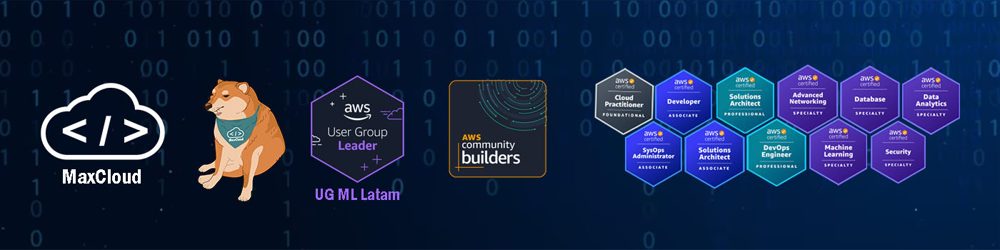
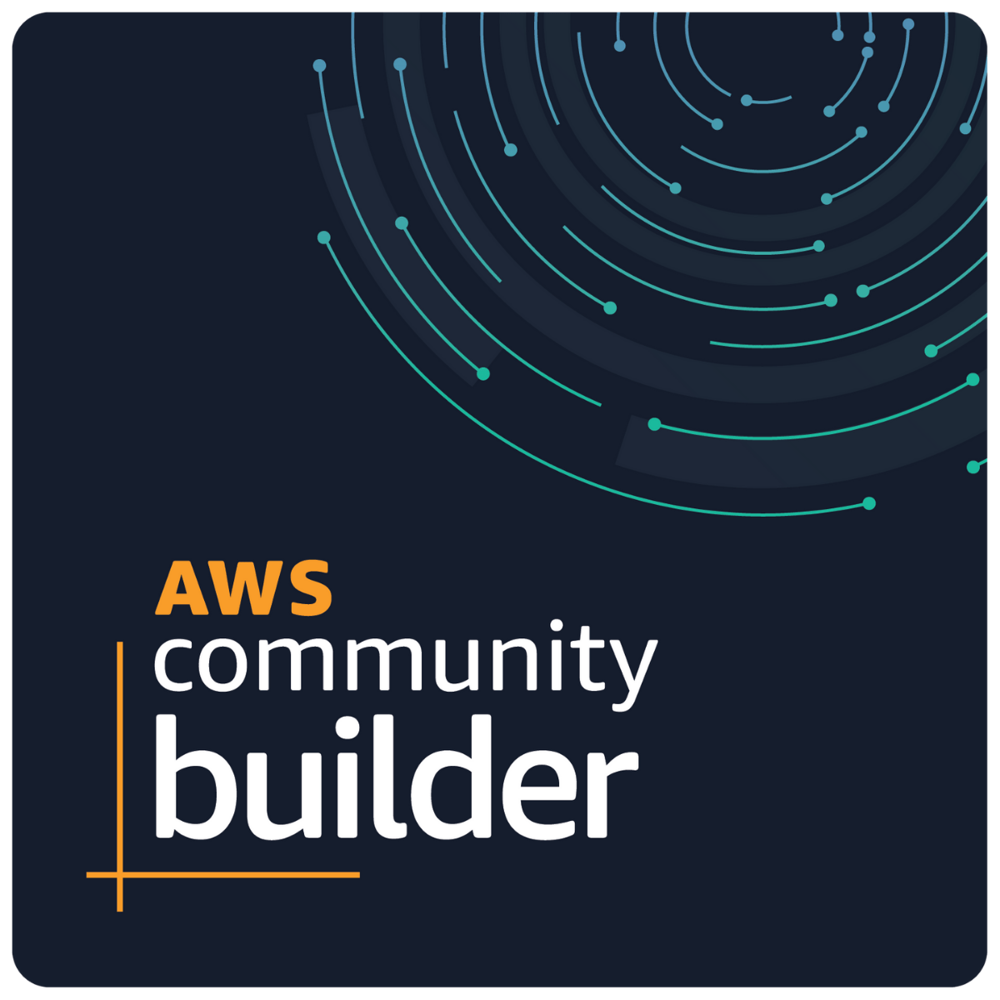
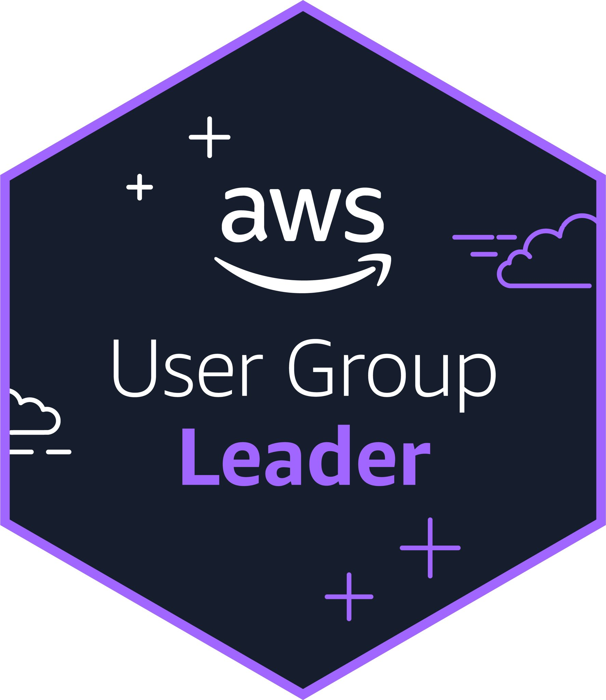

## **Hola! Soy Max!** 🤵

 

<!-- LIST-ACTIVITIES:START -->

- Trabajo en Rankmi como DataOps 🖥️
- Mis áreas de interés son DevOps, Machine Learning e Ingeniería de Datos 🛠️
- 11 certificaciones de AWS
- Nombrado <b>AWS Community Builder</b>  2 años consecutivos 🗣️
- Líder de la comunidad <b>AWS Machine Learning Latam </b>
- <b>AWS re:post</b> puesto #12 📈
- Instructor de tecnología 👨‍🏫 en Youtube: MaxCloud101
- 💬 Preguntame acerca de: AWS, Docker, Kubernetes, Development, DevOps, Datos 🐳
- 📫 Contactame en Linkedin: MaxCloud 👋
  
<!--LIST-ACTIVITIES:END -->

